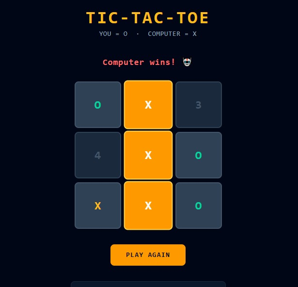
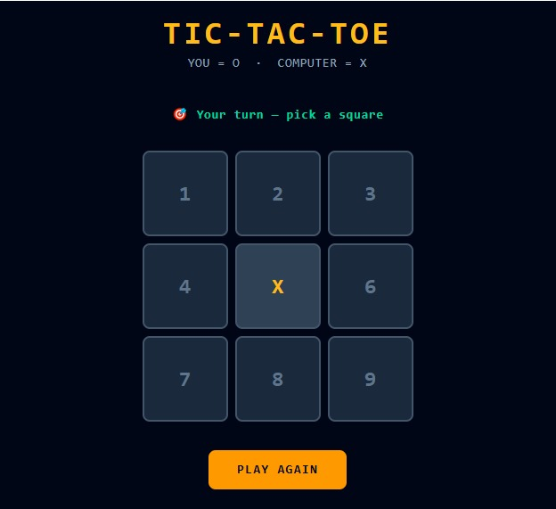

# 🎮 Tic-Tac-Toe React Game

A modern and interactive Tic-Tac-Toe game built using **React.js** and **Tailwind CSS**. Play against a computer opponent that automatically makes moves after each turn. The game features winner detection, move history tracking, responsive design, and a clean user interface.

---

## 🚀 Features

* ✅ Single-player gameplay against a computer
* ✅ Automatic winner detection
* ✅ Draw/Tie game detection
* ✅ Winning line highlighting
* ✅ Move history tracking
* ✅ Responsive user interface
* ✅ Built with React Hooks
* ✅ Styled using Tailwind CSS

---

## 🛠️ Tech Stack

| Technology   | Purpose              |
| ------------ | -------------------- |
| React.js     | Frontend Development |
| JavaScript   | Application Logic    |
| Tailwind CSS | Styling              |
| Vite         | Build Tool           |

---

## 📂 Project Structure

```text
tictactoe-react/
│
├── src/
│   ├── App.jsx
│   └── main.jsx
│
├── sample_outputs/
│   ├── img_1.jpeg
│   └── image-2.jpeg
│
├── public/
├── package.json
├── vite.config.js
└── README.md
```

---

## 🎯 Game Rules

1. The computer always starts first with **X** in the center.
2. The player uses **O**.
3. Players take turns marking empty squares.
4. The first player to align three symbols horizontally, vertically, or diagonally wins.
5. If all squares are filled without a winner, the game ends in a draw.

---

## 📸 Project Preview

<p align="center">
  
  
</p>

<p align="center">
  <b>React + Tailwind CSS Tic-Tac-Toe Game</b>
</p>


---

## ⚙️ Installation

### Clone the Repository

```bash
git clone https://github.com/Akhila-Palagani24/tictactoe-react.git
```

### Navigate to the Project

```bash
cd tictactoe-react
```

### Install Dependencies

```bash
npm install
```

### Run the Application

```bash
npm run dev
```

Open your browser and visit:

```text
http://localhost:5173
```

---

## 💡 Future Enhancements

* Smart AI using Minimax Algorithm
* Difficulty Levels
* Multiplayer Mode
* Scoreboard Tracking
* Sound Effects
* Theme Customization
* Mobile App Version

---

## 👨‍💻 Author

**Akhila Palagani**

B.Tech Student | AI & Full-Stack Enthusiast

GitHub: https://github.com/Akhila-Palagani24

---

## ⭐ Support

If you like this project, consider giving it a ⭐ on GitHub.

---

## 📜 License

This project is open-source and available under the MIT License.
